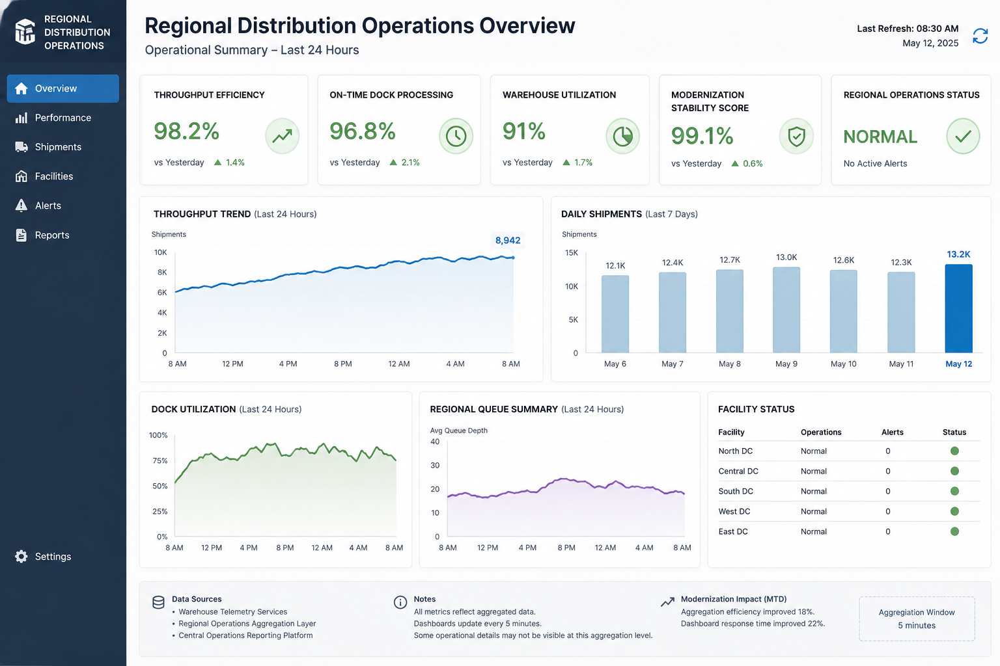
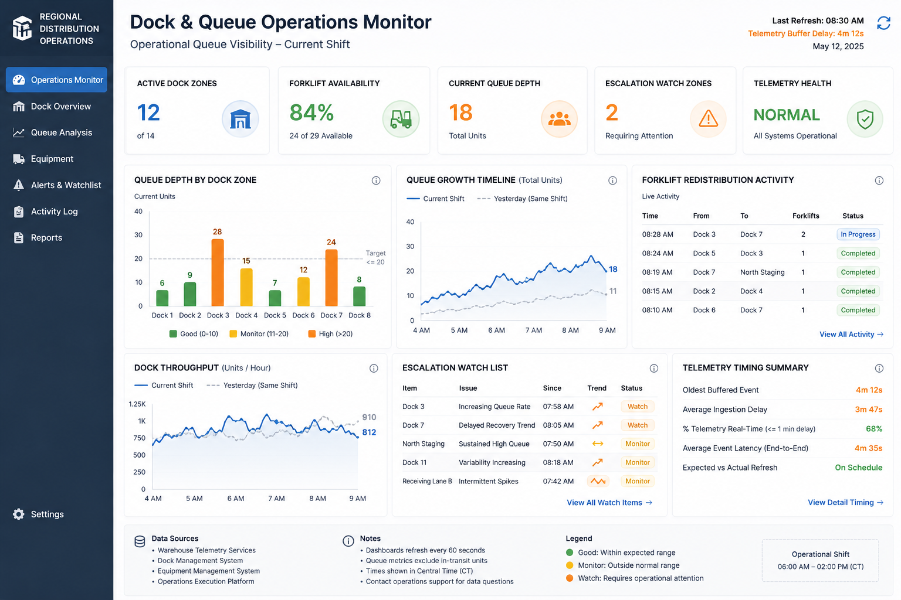
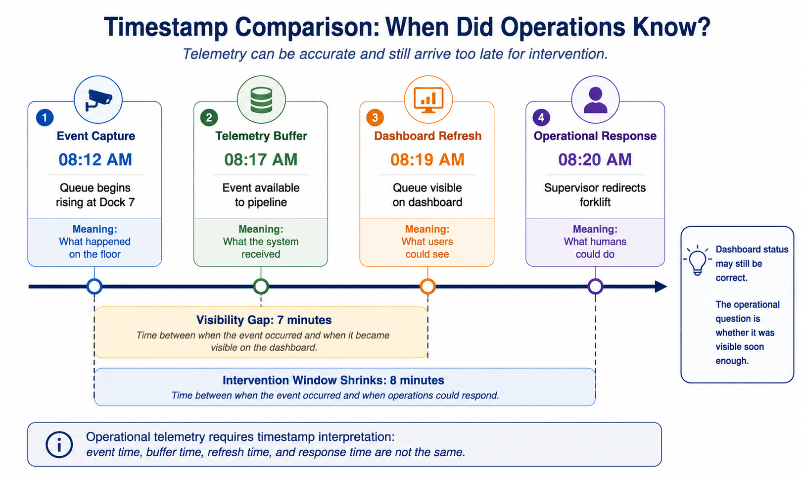

# AF002 Lesson 05 Release Candidate Hardening Draft v0.1.3

Course: AF-002 - IoT and AIoT for SAS Programmers
Status: RELEASE CANDIDATE HARDENING - GUIDED OPERATIONAL USE v0.1.3
Lesson: AF-002 — Lesson 05 Capstone
Title: Deliver Practical Results Using Telemetry
Focus: Operational modernization reasoning using telemetry evidence and SAS operational analysis

# File Reference Information

Repository-relative path: `/af-002-iot-aiot-for-sas-programmers/lessons/AF002_LESSON_05.md`

GitHub URL:
https://github.com/agentforgeframework-cpu/-agentforge-training/blob/main/af-002-iot-aiot-for-sas-programmers/lessons/AF002_LESSON_05.md

Raw URL:
https://raw.githubusercontent.com/agentforgeframework-cpu/-agentforge-training/refs/heads/main/af-002-iot-aiot-for-sas-programmers/lessons/AF002_LESSON_05.md

---

## Lesson Identity

This lesson is the AF-002 capstone experience.

The learner is no longer:

* learning what telemetry is
* learning what object detection is
* learning what bounding boxes are
* learning basic SAS operational workflows

The learner is now:

* interpreting operational evidence
* navigating bounded uncertainty
* communicating operational implications
* contributing credibly to operational modernization discussions

The lesson reinforces:

```text
Telemetry is evidence, not truth.
```

and:

```text
Architecture decisions are operational decisions.
```

without becoming:

* architecture evangelism
* anti-cloud rhetoric
* governance lecture
* executive roleplay theater

---

# Operational Context

You support operational analytics for a regional warehouse distribution operation.

Several modernization efforts were recently completed successfully.

The modernization achieved:

* reduced infrastructure complexity
* centralized dashboard management
* telemetry buffering improvements
* increased dashboard aggregation efficiency

Leadership considers the modernization:
successful.

Operations generally agrees.

However:

some warehouse supervisors have started reporting:

```text
The dashboards look normal,
but the warehouse floor feels different.
```

No major outage exists.

No emergency exists.

But:
operations staff increasingly feel they are reacting later than before.

You are asked to help investigate.

---

# Runtime Structure

This lesson is semi-interactive.

You should:

* inspect evidence
* review telemetry
* interpret SAS findings
* compare operational views
* identify uncertainty
* communicate operational meaning

You are NOT expected to:

* redesign enterprise architecture
* become an executive
* solve modernization strategy
* eliminate ambiguity completely

---

# Lesson Objectives

By the end of this lesson, you should be able to:

* interpret operational telemetry under modernization pressure
* identify visibility gaps caused by telemetry abstraction
* use SAS operationally to validate concerns
* distinguish telemetry evidence from operational truth
* communicate operational implications clearly
* contribute credibly to operational discussions
* reinforce Human-in-Command operational reasoning

---

# CHECKPOINT MODEL

This lesson contains visible checkpoints.

Example:

```text
CHECKPOINT — Initial SAS Investigation Complete
```

These markers exist to:

* stabilize runtime pacing
* reinforce learner progress
* support restartability
* improve operational clarity

---

# SECTION 1 — Operational Trigger

Monday morning operations review.

No critical incidents have been declared.

However:
multiple warehouse supervisors independently report:

* dock congestion feels harder to detect early
* forklift slowdowns seem visible later than before
* staffing adjustments feel delayed
* queue buildup “appears suddenly”

At the same time:

executive dashboards remain stable.

Throughput KPIs remain acceptable.
Modernization KPIs remain positive.
No major alerts are active.

You receive the following note from warehouse operations:

```text
The dashboards say we're fine.

The floor says we're reacting late.

Can you take a look before tomorrow's operational review meeting?
```

---

# SECTION 2 — Initial Evidence Package

Facilitator Note:
Do not explain the operational gap yet. Allow inspection first.

You are provided:

* Executive Operations Dashboard
* Warehouse Operations Dashboard
* Dock Queue Telemetry Extract
* Staffing Summary
* Shift Observation Notes

The dashboards appear:
professional,
stable,
and operationally believable.

No obvious failure is visible.

---

# Executive Dashboard



Artifact:
AF002_L05_EXECUTIVE_DASHBOARD_v0_1.png

Key operational observation:
The executive dashboard appears modern, stable, professional, and operationally successful.

Nothing immediately appears wrong.

However:
the dashboard is optimized primarily for:
- executive visibility
- operational summaries
- trend monitoring
- modernization KPI reporting

Question to consider:

```text
What operational details might become less visible
when telemetry is aggregated for executive simplicity?
```

---

# Operations Dashboard



Artifact:
AF002_L05_OPERATIONS_DASHBOARD_v0_1.png

This dashboard exposes:
- localized queue behavior
- operational variability
- escalation watch zones
- forklift redistribution activity
- operational intervention visibility

The dashboard still appears:
professional,
useful,
and operationally healthy.

However:
the learner should begin noticing:
operations personnel may experience the system differently than executives.

Question to consider:

```text
Why might warehouse supervisors sense operational discomfort
before executive dashboards show clear concern?
```

---

# SECTION 3 — Initial Interpretation

Facilitator Note:
Do not resolve the tension yet. Preserve ambiguity through Section 6.

Your first review suggests:

```text
Possible staffing imbalance during peak dock activity.
```

This is:
a reasonable operational interpretation.

You are NOT being trapped.

Real operational analysis often begins with:
reasonable but incomplete understanding.

You decide to investigate further using SAS.

---


# Operational Communication Before Analysis

Before you begin the SAS investigation, remember that the goal is not merely to run code.

The goal is to translate evidence into operational meaning.

Weak:

```text
The telemetry latency characteristics changed.
```

Stronger:

```text
We are still receiving operational telemetry,
but we now detect developing dock congestion later than before.
```

Operational meaning matters.

---

# SECTION 4 — Initial SAS Investigation

Facilitator Note:
Keep SAS execution time bounded. Operational interpretation is the goal.

You review:

* queue timing
* staffing alignment
* congestion intervals
* forklift idle windows

You compare:

* queue growth timing
* staffing availability
* dashboard refresh timing

---

# SAS Investigation Activity

Use the following telemetry sample:

`AF002_L05_TELEMETRY_SAMPLE_v0_1.csv`

Raw CSV:
`https://raw.githubusercontent.com/agentforgeframework-cpu/-agentforge-training/refs/heads/main/af-002-iot-aiot-for-sas-programmers/data/AF002_L05_TELEMETRY_SAMPLE_v0_1.csv`

Run the following SAS program:

`AF002_L05_TINY_SAS_OUTPUT_SET_v0_2.sas`

Raw SAS program:
`https://raw.githubusercontent.com/agentforgeframework-cpu/-agentforge-training/refs/heads/main/af-002-iot-aiot-for-sas-programmers/sas/AF002_L05_TINY_SAS_OUTPUT_SET_v0_2.sas`

Your focus is interpreting the operational meaning of the outputs, not writing SAS code from scratch.

Example operational observations:
- Queue depth crossed escalation-watch thresholds before dashboards visibly reflected concern.
- Operational visibility changed more slowly than physical queue conditions.

The SAS investigation generates:
- queue depth timeline
- timestamp comparison table
- queue depth by zone
- operational delay summary
- intervention window observations

As you review the outputs, pay particular attention to:
- queue growth timing
- timestamp semantics
- telemetry freshness
- dashboard delay
- operational intervention timing

Question to consider:

```text
Did the queue buildup appear sudden,
or did the operational visibility change?
```

---

# CHECKPOINT — Initial SAS Investigation Complete

Current understanding:

```text
Staffing may contribute,
but timing inconsistencies appear present in the telemetry itself.
```

---

# SECTION 5 — Evidence Divergence

You begin comparing:

* raw telemetry timing
* dashboard update timing
* floor observations
* operational event windows

Something now feels operationally inconsistent.

Warehouse supervisors describe:
“sudden queue spikes.”

But:
raw telemetry suggests:
the queue buildup was gradual.

You begin investigating timestamp behavior.

---

# Timestamp Comparison Graphic



Artifact:
AF002_L05_TIMESTAMP_COMPARISON_v0_1.png

This graphic demonstrates:
- event capture time
- telemetry buffer time
- dashboard refresh time
- operational response time

The key realization is:

```text
Telemetry can be accurate
and still arrive too late for intervention.
```

Question to consider:

```text
Which timestamp matters most operationally:
event capture,
dashboard refresh,
or operational response?
```

---


# Timestamp Lineage Definitions

The following timestamps represent different operational moments.

## event_capture_time

When the operational event actually occurred on the warehouse floor.

## telemetry_buffer_time

When telemetry became available to downstream telemetry systems after buffering or transport delay.

## dashboard_refresh_time

When dashboards displayed the event to operational users.

## operational_response_time

When humans could reasonably react operationally.

Important operational concept:

```text
These timestamps do NOT represent the same operational moment.
```

Simple operational example:

```text
A forklift slowdown may occur at 08:12,
appear in telemetry at 08:17,
reach the dashboard at 08:19,
and trigger operational response at 08:20.
```

## Optional PROC TIMEPLOT Exploration

Optional SAS program:

`AF002_L05_TIMESTAMP_TIMEPLOT_v0_1.sas`

Raw SAS program:
`https://raw.githubusercontent.com/agentforgeframework-cpu/-agentforge-training/refs/heads/main/af-002-iot-aiot-for-sas-programmers/sas/AF002_L05_TIMESTAMP_TIMEPLOT_v0_1.sas`


This optional exercise demonstrates how timestamp differences can become visible operationally when viewed across time.

The goal is not advanced SAS programming.

The goal is operational interpretation of:
- event timing
- telemetry buffering
- dashboard refresh timing
- operational response timing

Learners should compare:
- when events physically occurred
- when telemetry became visible
- when dashboards reflected operational conditions
- when humans could reasonably react

---

# SECTION 6 — Emerging Operational Discovery

You discover two modernization-related changes:

1. Dashboard aggregation intervals were increased.
2. Telemetry buffering was introduced before dashboard refresh.

Neither change is inherently wrong.

Both changes improved:

* infrastructure efficiency
* dashboard consistency
* centralized reporting behavior

However:

the operational side effect appears to be:

```text
Reduced visibility into rapidly developing queue buildup.
```

This does NOT mean:
the dashboards are false.

It means:
they are optimized differently.

---

# CHECKPOINT — Visibility Gap Identified

You now suspect:

```text
Operations is seeing congestion later than before,
even though executive reporting remains accurate at higher abstraction levels.
```

---

# SECTION 7 — Multiple Operational Views

You compare:

## Executive View

* throughput stable
* modernization successful
* operational KPIs acceptable

## Operations View

* delayed intervention timing
* queue buildup harder to detect early
* staffing adjustments happening later

## Raw Telemetry View

* congestion growth visible
* operational escalation detectable earlier
* timestamp semantics matter operationally

## SAS Investigation View

* telemetry freshness degradation affects intervention timing
* aggregation smooths escalation visibility
* delayed operational reaction windows emerge

---

# SECTION 8 — Operational Review Meeting

You attend the operational review meeting.

Participants include:

* warehouse operations lead
* modernization lead
* finance representative
* operations analytics staff
* you

Professional disagreement exists.

Nobody is behaving irrationally.
Nobody is the villain.

Different participants are observing:
different operational abstractions.

---

# Semi-Interactive Meeting Structure

The meeting should remain:
operational,
professional,
and evidence-driven.

The learner should:

* interpret findings
* answer operational questions
* explain uncertainty
* clarify telemetry meaning
* communicate operational implications

The learner should NOT:

* deliver dramatic speeches
* “win” arguments
* become an executive strategist

---


# Semi-Interactive Meeting Prompts

During the operational review meeting, consider the following questions carefully.

## Prompt 1 — Executive Interpretation

```text
The executive dashboard still shows acceptable throughput.

Should operations still be concerned?
Why or why not?
```

## Prompt 2 — Timestamp Meaning

```text
Which timestamp matters most operationally:
event capture,
dashboard refresh,
or operational response?

Explain your reasoning.
```

## Prompt 3 — Operational Tradeoff

```text
The modernization reduced infrastructure complexity
and improved centralized reporting consistency.

What operational capability became less visible?
```

## Prompt 4 — Human-in-Command

```text
Warehouse supervisors sensed operational discomfort
before dashboards clearly showed congestion.

How should organizations treat this type of human operational feedback?
```

## Prompt 5 — SAS Interpretation

```text
What did the SAS investigation reveal
that was less visible in the dashboards?
```

## Prompt 6 — Bounded Uncertainty

```text
Do the findings fully prove the root cause?

What uncertainty still remains?
```


# Suggested Learner Communication Style

Weak:

```text
The telemetry latency characteristics changed.
```

Stronger:

```text
We are still receiving operational telemetry,
but we now detect developing dock congestion later than before.
```

Operational meaning matters.

---

# SECTION 9 — Primary Realization

The modernization did NOT fail.

The dashboards are NOT useless.

The telemetry is NOT fake.

Instead:

```text
Different operational phases
require different operational visibility.
```

Executive dashboards remain operationally useful.

However:
warehouse intervention workflows require:
fresher operational visibility windows.

This is an operational tradeoff discussion,
not a technology war.

---

# CHECKPOINT — Operational Tradeoff Recognized

You now understand:

```text
Modernization improved some operational capabilities
while unintentionally reducing others.
```

---

# SECTION 10 — Recommendation Development

You are asked to provide a short operational findings summary.

Use the following structure.

---

# Operational Findings Summary Template

## Observations

* What operational behavior was observed?

## Findings

* What evidence supports the findings?

## Operational Implications

* What operational consequence emerges?

## Recommendations

* What proportional operational adjustments may help?

## Remaining Uncertainty

* What still requires validation?

---

# Suggested Recommendation Direction

Possible proportional improvements:

* preserve fresher operational telemetry windows
* retain higher-granularity operational queue visibility
* separate executive and operations telemetry views
* preserve operator-level escalation visibility
* maintain Human-in-Command operational review loops

Avoid:

* “replace everything”
* “rollback modernization”
* architecture absolutism

---

# SECTION 11 — Human-in-Command Closure

This lesson is not about:

* dashboards being bad
* modernization being bad
* telemetry being wrong
* humans rejecting technology

It is about:

```text
Humans remaining responsible
for operational judgment
inside increasingly abstract operational systems.
```

Telemetry assisted operations.

Dashboards assisted operations.

SAS analysis assisted operations.

Humans still interpreted reality.

---

# FINAL CHECKPOINT — Capstone Complete

By completing this lesson,
you have practiced:

* operational telemetry interpretation
* SAS-supported operational reasoning
* bounded skepticism
* modernization tradeoff analysis
* evidence-based communication
* Human-in-Command operational thinking

You are no longer:
simply reading telemetry.

You are now contributing operational understanding.

---

# Development Notes - Release Candidate A for Version 1.0

Current Status:

* runtime architecture established
* emotional arc established
* operational identity stabilized
* modernization framing stabilized
* SAS insertion points identified
* dashboard placeholders identified
* artifact milestones identified
* 
---

# Development & Test Environment

Platform: ChatGPT
Model: GPT-5.5
Date: 2026-05-26

Notes:

* Release Candidate A generated following Lesson 04 stabilization findings.
* Runtime structure intentionally emphasizes operational realism, SAS reasoning, visible evidence chains, and Human-in-Command continuity.
* Visual and SAS artifacts intentionally deferred to iterative validation passes.

---

This draft was created based on the stabilized AF-002 operational identity developed through Lesson 04 runtime testing and capstone planning discussions.

# License

Paul McDonald Open Use License (MIT-style)

© 2026 Paul McDonald

---

Next Lesson:
None

Return to README:
https://github.com/agentforgeframework-cpu/-agentforge-training/blob/main/af-002-iot-aiot-for-sas-programmers/README.md

